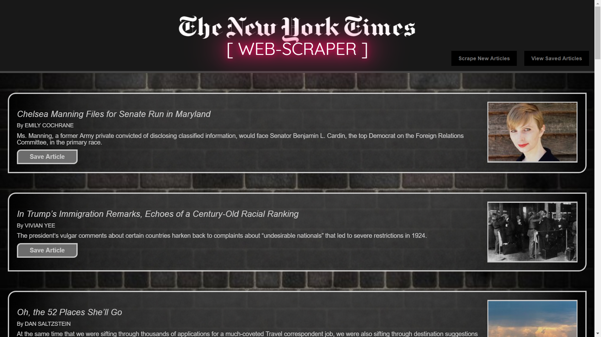
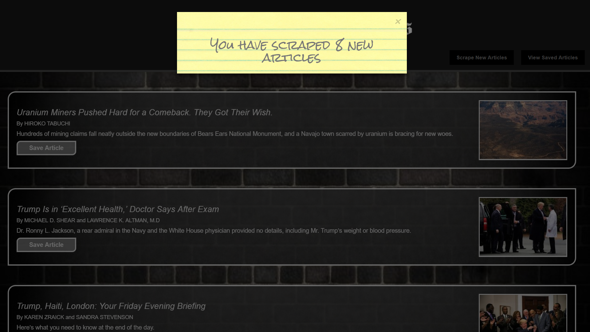
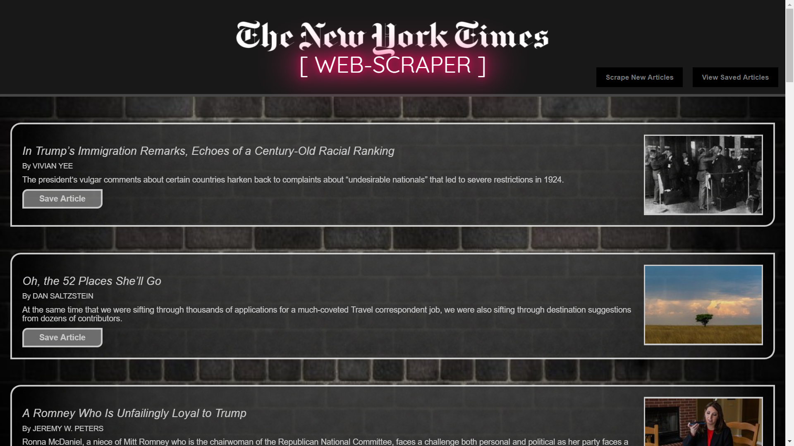
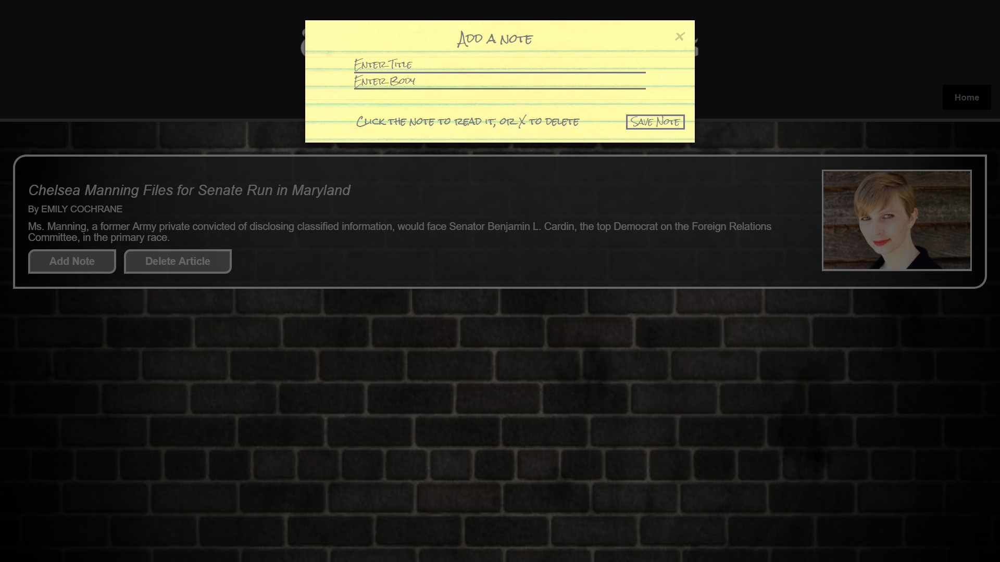
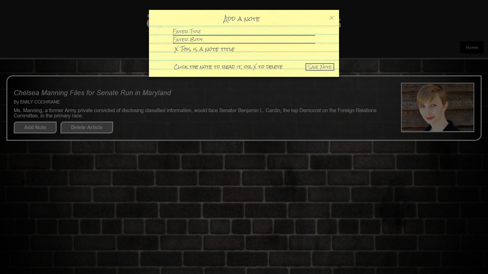

# **MongoDB/Mongoose NYT web-scraper**

### To view the deployed version, _**[click here!](https://mongo-scraper-principio.herokuapp.com/)**_

## Technologies used:
* Node.js
* Express.js
* MongoDB
* Mongoose
* Handlebars.js
* Javascript/ES6
* jQuery
* AJAX/JSON
* NPM modules:
  * Cheerio
  * Request-Promise
* Bootstrap 3
* CSS3 (including css animations and transitions)
* HTML5

## This is an app that uses Cheerio to scrape the New York Times US section and pull the most recent 20 articles:

## Whenever the user chooses, they can scrape the newest articles that have been added:

## Users can click on the images or the title to take them to the corresponding NYT article, or click the 'Save Article' button to save the article:

## Once an article is saved, the user has the option to add their own notes to the articles, or to remove them:

## Users can type in a note title and body, and save notes specific to that article:

## If the user wishes to access the body of the note, they can click on the note and the form will be populated with the note body and title:

## The user can also delete notes that are no longer needed by clicking on the 'X':

## If the article is no longer of use, the user may delete it:

